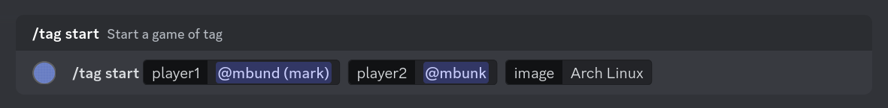
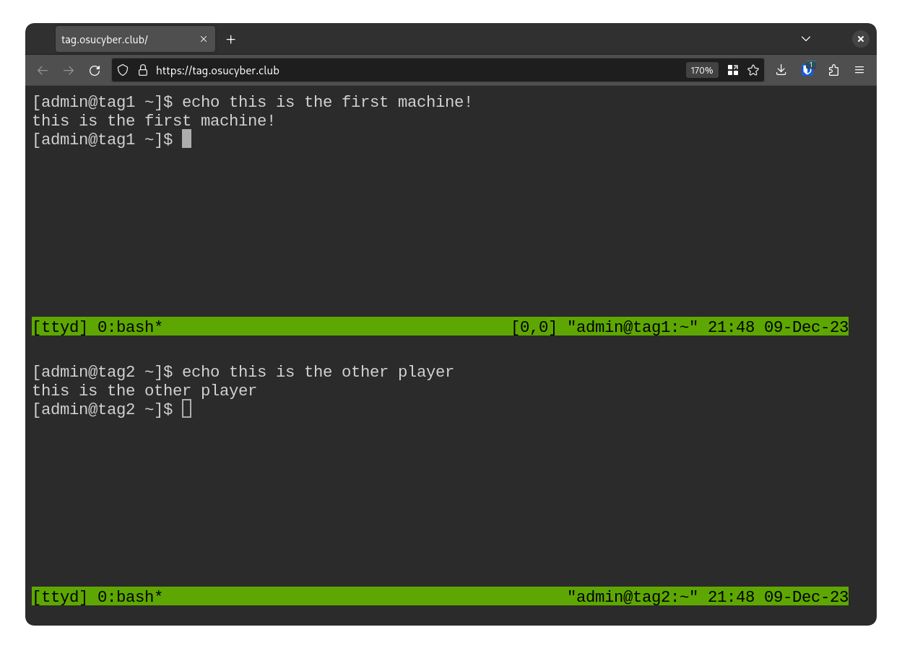

# Tag game

Play tag in the browser!

## Rules

- The game is played by two players sitting opposite each other on their laptops
- Each player is equipped with a browser VM running an OS (e.g. Arch Linux) which does not have access to the internet
- The players start hands-on at their computers the same time by an adjudicator
- They each get 7 minutes to install as many backdoors as possible on the other player's computer
- The players then switch computers and try to find the backdoors installed by the other player and remove them in again 7 minutes
- Points are scored for each backdoor that was installed which still remained
  - What counts as a backdoor is at the discretion of the adjudicator
  - In general backdoors can be privilege escalation, remote access, other persistence, etc.
  - The players should not render the their own computer unusable before switching (don't lock root user, completely destroy config files, etc.)

## Usage

This repository has a discord bot to automatically provision linux VMs for the game which are then accessible from the browser.



There is also an observer mode which allows spectators to watch both players' screens at the same time.



## Setup

Apply the manifests to deploy the bot with proper permissions into its own namespace. Note that this bot is only designed to work with the Cyber Security Club's Kubernetes cluster. It has a few hardcoded role id's and requires the [sysbox](https://github.com/nestybox/sysbox) runtime to be installed on the cluster.

```
kubectl apply -f manifests.yaml
```
